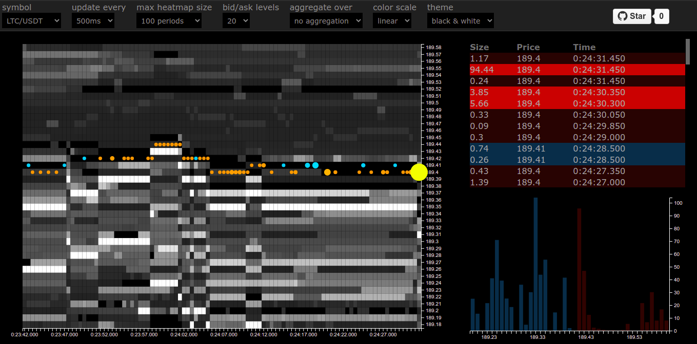
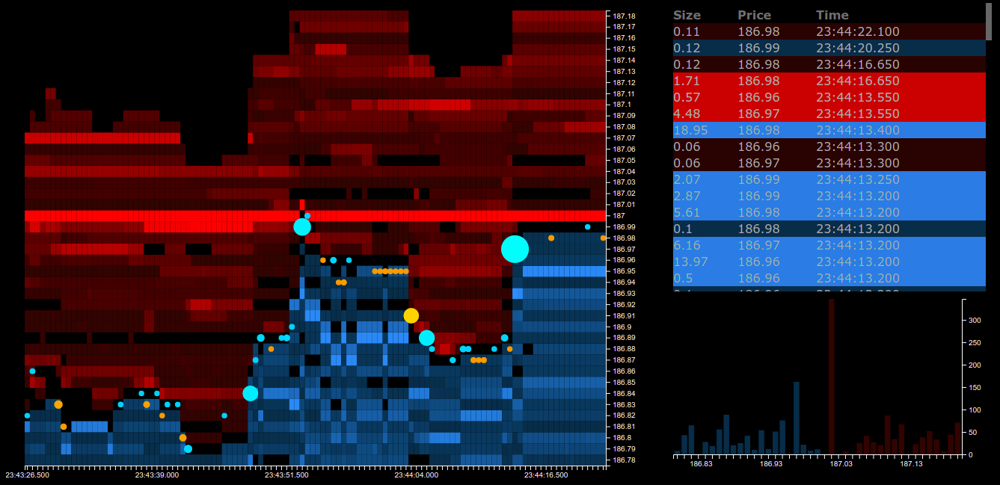

Try it with live data: [https://elenchev.github.io/order-book-heatmap/](https://elenchev.github.io/order-book-heatmap/)

# Order Book Heatmap
This repo implements a live limit order book heatmap, resting limit orders graph and a buffered time &amp; sales log. Market data is received through a custom Binance WS client, which feeds data into a simple orderbook structure, responsible for keeping track of all market deltas and returning snapshots to the D3 visualizations.

The main goal of this project was to familiarize myself with the Binance WS APIs and the data streams that they provide. Keep in mind that this was writtin in a couple of days, it's nowhere near close to handling all possible market states.


# Structure
## lib/BinanceDataFeed.js
Binance WS Client (100% coverage) + some of the Binance REST API requests (5% coverage) but only what was necessary - mostly symbol info & snapshot requests. There are better clients out there, but I wanted to get familiar with the API. I recommend using a different client, but if you're interested in this implementation, check out `examples/datafeed-example.js`
The class lets users subscribe to 1 or more data streams and reuses streams if multiple clients subscribe to the same one. It's pretty easy to use. The following command will log all BTC/USDT trades to the console:
```
feed.subscribe('BTCUSDT', {
  onTrade: (data) => console.log(data)
});
```

## lib/BinanceOrderBook.js
Limit order book implementation, which depends on `BinanceDataFeed.js`. Internal structures keep a live representation of the limit order book. The class also keeps track of all trades and calculates some simple statistics. Check out `examples/orderbook-example.js` to see how to use it.

BinanceOrderBook.js provides a `getSnapshot` method, which is what the vosialization modules use in order to display all heatmaps & charts.

## lib/Tick.js
Unfortunately Binance uses strings for all prices, volumes & quanitites, instead of just returning the number of ticks (int) representing the price. Simply using parseFloat introduces a lot of inaccuracies. `Tick.js` handles all this by allowing you to work with ticks instead of strings. It lets you parse, round, add, substract, increment, decrement, multiply and divide. It also handles aggregation, if you want to use the same instance to work with ticks as well as steps (multiples of N ticks).

## src/Dashboard.js
This class makes calls `lib/BinanceOrderBook.js` on regular intervals specified by the user, and uses the snapshot provided by it to render different visualizations. Some notable features:
* Heatmap visualizing resting limit orders. Brighter colors represent higher liquidity at that price
* Circles representing market order deltas over the past period. The circle size depends on the total number of traded contracts, the color depends on the total number of buy vs sell contracts. The intensity of the circle depends on the ratio between buy & sale market orders
* Linear vs Logarithmic color scales, 2 color themes, flexible update interval, different # of price levels & several symbols supported
* Bar chart visualization of resting orders at all prices close to the bid/ask
* Time & Sales log, with top 10% of orders (by size) highlighter

# Notes & TODOs
* The project supports all Binance instruments, but highly volatile instruments don't work well with the heatmap. The solution would be to use aggregated prices, which is something that the OrderBook class already supports. I wasn't very interested in this use case, but implementing it would be pretty easy.
* All visualizations use SVG. Replacing all SVGs with canvas elements will improve performance significantly.
* The datafeed module does not make requests to the long connection Binance URL, so connections will time out after 1 hour. This was done partially because I didn't need it, and partially so that I didn't have to worry about handling credentials in a public repo.

# Screenshots



